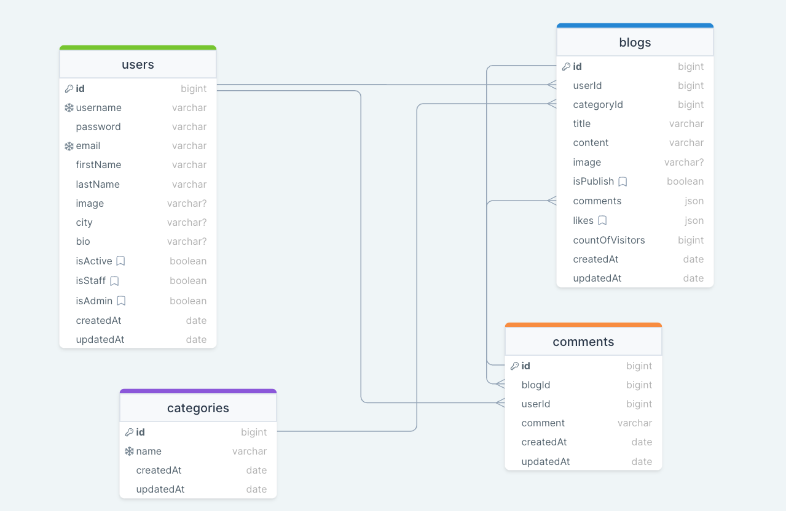

# Blog Api

This project is a Node.js-based REST API server designed to handle stock management-related operations.

## Backend Documentation:

[Blog API Documentation](https://blog-api-9uyr.onrender.com/)

### ERD:



### Blog App Frontend (Blog App)

[Frontend](#frontend)

### Folder/File Structure:

```
Blog API

├── src
|    ├── configs
|    │   ├── dbConnection.js
|    │   └── swagger.json
|    ├── controllers
|    │   ├── auth.js
|    │   ├── blog.js
|    │   ├── category.js
|    │   ├── comment.js
|    │   ├── token.js
|    │   └── user.js
|    ├── helpers
|    │   ├── dateToLocaleString.js
|    │   ├── passwordEncrypt.js
|    │   ├── sendMail.js
|    │   └── sync.js
|    ├── middlewares
|    │   ├── authentication.js
|    │   ├── errorHandler.js
|    │   ├── findSearchSortPage.js
|    │   ├── logger.js
|    │   └── permissions.js
|    ├── models
|    │   ├── blog.js
|    │   ├── category.js
|    │   ├── comment.js
|    │   ├── token.js
|    │   └── user.js
|    ├── routes
|    │   ├── auth.js
|    │   ├── blog.js
|    │   ├── category.js
|    │   ├── comment.js
|    │   ├── document.js
|    │   ├── index.js
|    │   ├── token.js
|    │   └── user.js
├── index.js
├── pacgake-lock.json
├── pacgake.json
├── readme.md
└── swaggerAutogen.js

```

## Frontend:

[Blog App GitHub](https://github.com/cihanbagriyanik/Milestone-_BlogApp_react-ts-vite-mui-redux-formik-yup)

[Blog App (Link)](https://blog-app-cihan.vercel.app/)

## Technologies Used

- **Express.js**: A fast and minimal web framework used for API routing and handling HTTP request/response operations in this project.
- **Mongoose**: An Object Data Modeling (ODM) library for MongoDB used to create models and simplify database operations.
- **JWT (JSON Web Token)**: Used for user authentication and authorization, allowing users to authenticate and make authorized API requests.
- **Swagger UI Express**: Utilized to automatically generate and visualize API documentation, enabling users to easily view the API endpoints.
- **Cors**: Employed to solve Cross-Origin Resource Sharing (CORS) issues, allowing requests from different origins to access the API.
- **Dotenv**: Used to load and utilize environment variables, especially for storing sensitive data such as database connection information.
- **Nodemailer**: Utilized for sending emails, particularly for sending verification emails to users after registration.

## How to Use?

1. Clone the project to your computer: `git clone https://github.com/cihanbagriyanik/BlogAPI.git`
2. Navigate to the project directory: `cd BlogAPI`
3. Install the necessary dependencies: `npm install`
4. Connect your database or set up your local database. Update the `.env` file with the required environment variables, such as `MONGODB_URI` for MongoDB connection."
5. Start the application: `npm run start`
6. You can access the API at `http://localhost:PORT`.

## API Documentation(local)

For more information about all the endpoints and how to use them, you can access the [Swagger UI](https://blog-api-9uyr.onrender.com/documents/swagger/).

## Contribution

Contributions to this project are welcome! If you find a bug or want to add a feature, please open a pull request or create an issue.

## License

This project is licensed under the ISC License. See the LICENSE file for more information.
